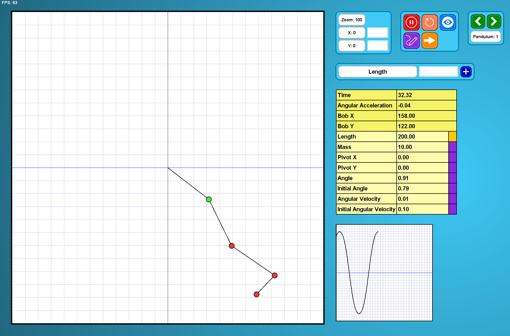

# Pendulum Simulation



## Overview

This project is a **real-time pendulum simulation** written in Java using Swing.  
It allows you to simulate multiple pendulums, trace their motion, visualize velocities with arrows, and dynamically adjust pendulum properties such as length, angle, and angular velocity.

Features include:

- Multiple pendulums with configurable properties.
- Chain pendulum setup where each pendulum can be connected to the previous pendulum’s bob.
- Real-time trail visualization of pendulum paths.
- Dynamic adjustment of pendulum properties via GUI.
- Camera movement, zoom, and "follow" mode.
- Velocity arrow visualization.
- Change camera position by dragging
- Change zoom by scroll wheel
- Change which pendulum you're observing which includes trace and follow
- Hover over buttons to see what they do
- Simple graph that shows the x position of the pendulum selected

## Controls

- **STOP/START:** Pause or resume the simulation.  
- **Reset:** Reset all pendulums to their initial state.  
- **Follow:** Camera follows the observed pendulum.  
- **Trace:** Toggle trail drawing for observed pendulum.  
- **Arrow:** Toggle velocity arrow for observed pendulum.  
- **Previous/Next Pendulum:** Switch between pendulums to adjust their properties.  
- **Property Tabs and SET button:** Adjust pendulum parameters (length, mass, pivot, angle, etc.).

## Requirements

- Java 11 or higher.
- Swing-compatible environment (GUI desktop application).

## Installation

1. Clone the repository:  

```bash
git clone https://github.com/your-username/pendulum-simulation.git
